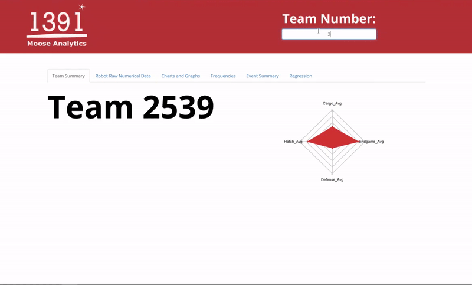

<h1>Moose Analytics v1.0</h1>
<h4>Graphical Update and Major Launch</h4>

A webapp created with R Shiny to show graphs and different data analytic function.
Main app is coded in R in the ui.R file and the server.R files
 
<h4>Website Link:</h4>  
https://mooseanalytics.shinyapps.io/webapp/

<h3>Just Type in the Team Number!</h3> 

 
<b>PACKAGES</b> 
<code>shiny</code> 
<code>dplyr</code> 
<code>DT</code> 
<code>ggplot2</code> 
<code>fmsb</code> 
<code>tibble</code> 

 
Reading 2019_03_03_Hatboro.csv

Last UPDATED March 6, 2019  
1:00pm  

